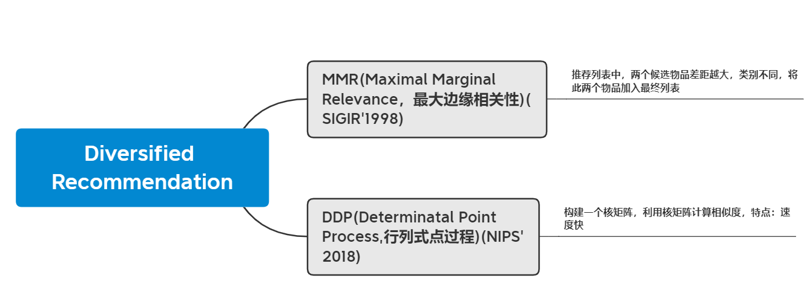
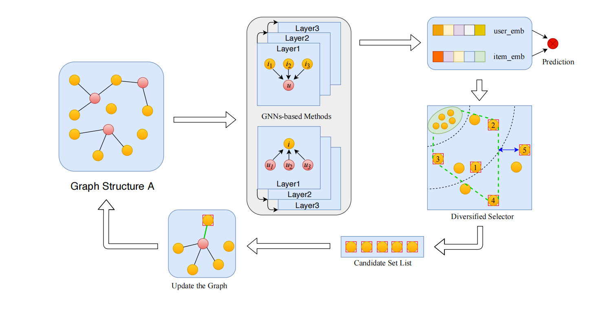
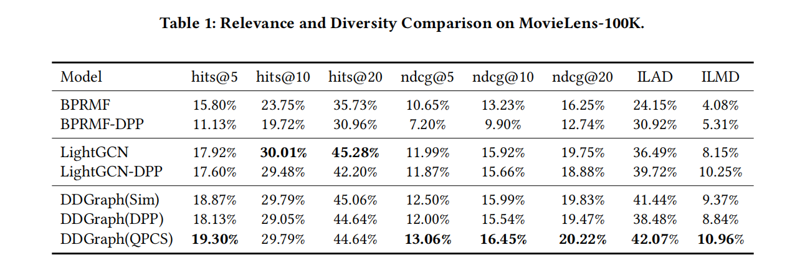
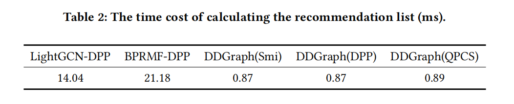
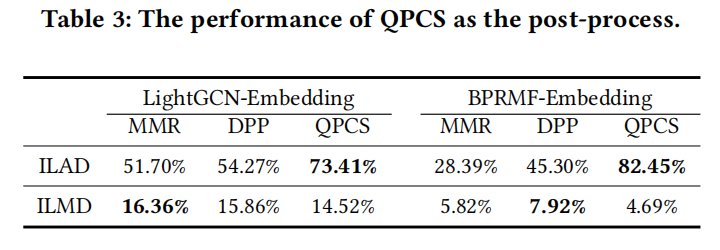
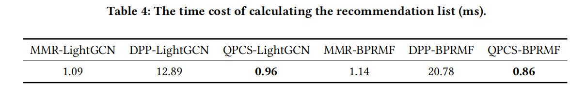

# Dynamic Graph Construction for Improving Diversity of Recommendation

作者：Yuqing Hou,etc

单位：美团

会议：RecSys’2021

## 当前多样性推荐存在的问题

1. 大多数多样化的推荐任务通常利用用户项交互记录来挖掘用户的**显式偏好**，而很少探索用户-项的**非交互记录**。然而，对于多样化的建议，被忽视的非交互记录对于获取用户的潜在兴趣以提高推荐的多样性尤为重要。

2. 此外，大多数多元化推荐方法分**两个阶段**运行：**首先**通过相关性优化用户和项目嵌入，**然后**通过后处理方法生成多元化项目列表。这些方法都**<u>不是端到端</u>**的，因此很难达到全局最优。

**总结：**

- 需要利用用户隐性特征
- 实现端到端

作者为了解决上述限制，我们提出了一种**端到端动态多元化图框架(DDGraph)**，该框架基于用户和项目嵌入动态构建用户-项目图。

从技术上讲，我们初始化一个用户-项目交互图，并通过为每个用户选择一组不同的项目，并在项目和用户之间建立链接来动态更新图。不同项目的选择可以通过不同的候选选择操作符来实现。具体地说，我们设计了一个**基于潜在空间划分的分位数渐进候选选择**(a Quantile Progressive Candidate Selection，QPCS)算子。

**据我们所知**，我们的方法是第一个通过动态端到端图构造来分散推荐结果的方法，并且QPCS比其他算子具有更高的计算效率

## 多样化推荐的发展历程

DPP(Determinatal Point Process, DPP): SOTA方法

**DivKG**方法将图嵌入方法和DPP相结合，增强了多样性。DivKG首先采用**TransE**方法，通过优化基于边际的损失来获得用户和项目的嵌入，然后利用所获得的嵌入数来构造的基于DPP的核矩阵实现多样性

*Enhancing recommendation diversity using determinantal point processes on knowledge graphs. SIGIR’2020*

DivKG等基于dpp的方法已经实现了相关性和多样性之间的权衡，**但仍存在一些局限性，面临着一些挑战**

**局限性：**

- 首先，基于mmr和基于dpp的方法都不是端到端的，其中嵌入和多样性的优化被分为两个阶段。这一特性不可避免地会影响到获得全局最优解的能力。
- 其次，真实世界的数据集通常是不平衡的，因为大多数用户只与一小部分项目进行交互，这使得很难获取用户的潜在兴趣。

**解决方式：**

i) 由于用户-项目交互可以自然地构建为一个图，因此采用图神经网络(GNNs)来学习用户和项目嵌入是一个合理的选择。

ii) 同时，图的结构可以动态地丰富，这为用户提供了更多的项目邻居。由于受到不同项目的影响，可以以端到端的方式优化嵌入和多样性。

**核心技术：**

QPCS利用q-分位数将潜在空间划分为多个区域，并选择不同区域的项目来提高多样性

**指明：**

何向南提出了LightGCN，它放弃了NGCF中的特征变换和非线性激活，更简洁，更适合推荐。

**模型的优越性：**

我们的模型通过基于gnn的方法学习嵌入，嵌入配备了不同的信息。DDGraph与其他基于gnns的模型之间的区别在于，我们的方法中的图结构是基于选择器操作符QPCS动态更新的。此外，与基于dpp和基于mmr的方法相比，我们的框架是一个**端到端模型**，而不是一个两阶段的模型

## 框架概述

(i)   用户和项目表示的图形嵌入，将用户-项目交互构建到图形结构中，并应用图神经网络获取用户和项目表示。

(ii)  多元化选择操作员，根据用户和项目表示，为每个用户选择多元化的项目。

(iii) 图的更新框架，根据多样化选择算子的结果对图的结构进行更新。

### 图的user和item表示

$U=\{u_1,u_2,...,u_m\}  \ \ \ user$

$I =\{i_1,i_2,...,i_m\}  \ \ \ item$

$R^{m \times n} \ \ \ 共现矩阵$

$embedding矩阵：E \in R^{(m+n)*d}$

取E的转置

**d: 通过矩阵分解获得，m * d  d * n**

***如果你与项目i交互则是1，否则是0***

以上都是GNN的相关知识，没有区别

$P_u: 对于user_u与item有交互的集合$

$C_u: 对于user_u与item没有交互的集合$

$N_u: 初始化为空集，从C_u中挑选的，作为已观测的邻域$

$I = P_u \cup C_u$

### QPCS

将Cu划分为q个子域，子域内部元素之间dist小，不同子域的元素dist大（类似聚类）

对每个子域进行下列判断

$i_{C_u} \in C_u \ \  计算距离函数：Dist(i_{C_u},P_u \cup N_u)$

$Dist(i_{C_u},P_u \cup N_u)=min||i_{C_u}-i_{P_u \cup N_u}||_2$

**Rel(i,u):用相似性函数度量（sim）**——我的理解，原论文没有提

### 优化图结构

$R^{div} \in R^{m \times n} \  \ \ R_{ui}^{div}=1\ or \ 0 \ \ item_i是否属于N_u$

## 实验结果

Dataset:**movielens-100k**

**DDGraph(QPCS)优于DDGraph(Sim)和DDGraph(DPP)，它们之间唯一的区别是候选选择器操作方式。因此，很明显，QPCS对于选择不同的项目更为强大。**

### 超参数设置

embeddin_size = 100 (自己设置的，与比较的原论文不同)

多元化邻居集Nu = 10，

潜在空间q = 4

训练过程中每50个周期更新一次图结构

### 评价指标

ILAD--Intra-list **average** distance   列表内平均距离

ILMD--Intra-list **minimal** distance 列表内最小距离

越大越好

### 消融实验

**由表格可得：优化ILAD比优化ILMD更实用**

针对一个用户计算平均时间

