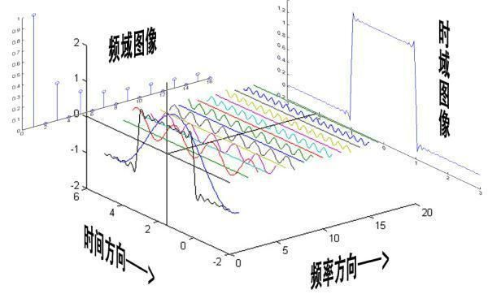
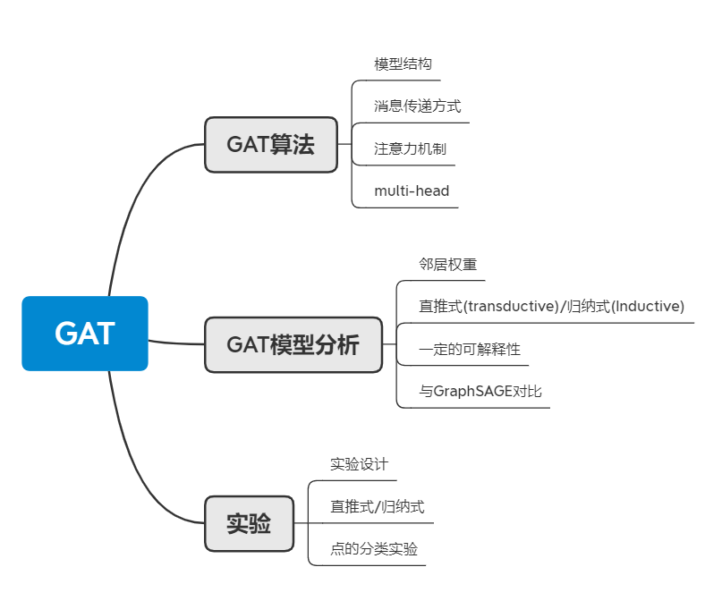
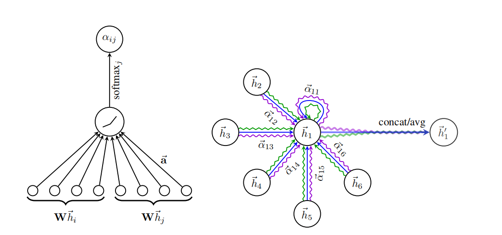

# Graph Attention Network 

作者：petar velickovic，==Yoshua Bengio==

单位：剑桥大学，MILA

会议：ICLR’2018

## 卷积中的时域、空域

- spectral
- non-spectral

GAT：是基于空域的模型

左边：空域  

右边：频域

## 论文结构

### 图像上的卷积操作

### 图上的卷积操作

- GCN:（ha+hb+hc+hd）/   4
- GraphSage:   maxpooling(ha,hb,hc,hd)
- GAT:  计算两个点之间的相似度，如果两个点之间相似度高，赋予权值越大

### 计算图

### 直推式(transductive)/归纳式(inductive learning)

不同于传统的图学习——都是直推式（相当于对训练集和测试集都进行训练）

GCN、GAT、GraphSage都可用于归纳式学习

### GAT中的multi-head

### 算法细节

$input: h={\vec{h_1},\vec{h_2},...,\vec{h_n}}$

$\vec{h_i} \in R^F$ : 即每个**hi**的维度是F

$output: h’={\vec{h'_1},\vec{h'_2},...,\vec{h'_n}}$

$\vec{h'_i} \in R^{F'}$ : 即每个**h’i**的维度是F’

