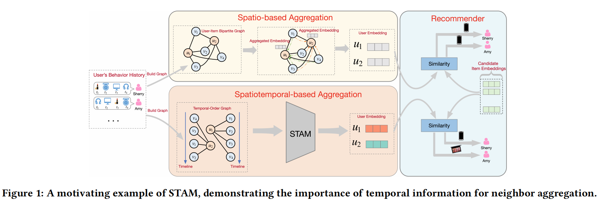

# STAM: A Spatiotemporal Aggregation Method for Graph Neural Network-based Recommendation(一种是时空聚合的基于图神经网络的推荐)

[TOC]

## 摘要

​        基于图神经网络的推荐系统近年来蓬勃发展，其核心组成部分是确定邻居嵌入学习的聚合方法。现有研究通常关注如何从空间结构信息的角度聚合信息，但关于邻居的时间信息没有得到充分的探索。

​        在这项工作中，我们提出了一种时空聚合方法STAM，以有效地将时间信息纳入邻居嵌入学习。STAM从空间结构信息和时间信息的角度生成时空邻居嵌入，促进了从空间到时空的聚合方法的发展。STAM利用缩放点积注意来捕获一跳邻居的时间顺序，并使用多头注意在不同的潜在子空间上执行联合注意。我们利用STAM进行基于GNN的推荐来学习用户和项目嵌入。大量的实验表明，与基于空间的聚合方法相比，STAM在基于gnn的推荐方面有了显著的改进，例如，在𝑀𝑅𝑅@20方面，MovieLens为24%，Amazon为8%，Taobao为13%

## 介绍

​        推荐系统是执行个性化信息协同过滤的关键工具，已应用于许多在线服务。推荐的本质是从过去的用户-项目交互中学习用户和项目的潜在表征，并预测用户在未来与之交互的项目。

​        大多数工作以推荐任务作为**矩阵**完成任务。协同过滤（CF）是一种传统的预测用户和项目之间得分的推荐方法。矩阵分解（MF）学习用户和项目的潜在向量来重建交互矩阵。由于深度学习的成功，最近的研究使用神经网络，如多层感知（MLP），来捕获用户和项目之间的非线性交互。近年来，人们对图神经网络（GNNs）产生了极大的兴趣，其信息传播机制改进了下游任务，在许多具有挑战性的任务中显示出了广阔的前景。

​        由于图神经网络在图数据学习方面的优越性，基于gnn的推荐将用户-项目交互建模为一个图，并利用gnn将空间结构信息合并到嵌入中。大量基于gnn的推荐工作从空间结构信息的角度研究了良好的聚合方法来学习用户和项目的嵌入。现有的聚合方法大致可分为四种：1. mean pooling(均值化邻域) : 平均地处理邻域；2.degree normalization(节点度归一化)：根据图的结构为节点分配权重；3. attentive pooling(注意力池化)：用注意力机制处理邻域；4. central node augmentation(中心节点聚合)：考虑节点之间相关性，并使用中心节点来过滤邻居的消息。**然而，上述方法忽略了邻居的时间信息，该时间信息是对基于GNN的推荐中的聚合有显著贡献的重要信号，但未在邻居嵌入学习中编码。**

​       在之前基于GNN的推荐中，邻居聚合方法只涉及空间结构信息，而忽略了邻居的时间信息，不能捕获用户的动态兴趣。电子商务平台的基本能力是收集丰富的用户行为历史和时间信息。然而，在基于GNN的建议中，之前的聚合方法还没有充分利用这些时间信息来学习高质量的嵌入，而只显示了用户的内在兴趣。为了解决上述问题，我们将时间信息整合到聚合方法中，以促进聚合从空间到时空的发展。

​        为了充分理解这项工作的动机，我们给出了一个关于STAM的典型例子，来展示时间信息在基于GNN的推荐中的重要作用。在Figure 1中，我们从用户的行为历史中选择两个用户（Amy和Sherry），分别构建一个用户-项二部图和一个基于GNN的推荐的时间序列图。在基于空间的聚合中，Amy和Sherry的聚合邻居嵌入是相同的，因为它们与相同的项目交互。与LightGCN类似，我们省略了非线性转换，并利用聚合的邻居嵌入作为一跳用户嵌入。因此，推荐者推荐Amy和Sherry的一个相同的项目。然而，Amy和Sherry的推荐项目在基于时空的聚合方面是不同的。**在基于时空的聚合中，我们将时间信息纳入到邻居嵌入学习中，其中时间顺序在捕获用户的动态兴趣和用户集群随时间的变化方面起着至关重要的作用。**

​        在这项工作中，我们强调了在基于GNN的推荐中，时间信息仍然没有被用于邻居聚合的问题。我们提出了一种新的基于时空聚合方法（STAM）的聚合方法，将时间信息整合到邻居嵌入学习中，促进了从空间到时空的聚合方法的发展。STAM从空间结构和时间顺序的角度生成时空邻居嵌入。在STAM中，采用缩放点积注意来捕获一跳邻居的时间顺序。

​        为了改进STAM的表达性，我们学习了STAM中的多个注意头，它们对不同的潜在子空间进行联合注意。

​        STAM不能改变基于GNN的推荐的框架，因为它可以很自然地插入到现有的基于GNN的推荐模型中。我们将STAM应用于基于GNN的推荐，并将其性能与具有代表性的基于GNN和顺序推荐模型进行比较。实验结果表明，STAM优于最先进的模型在MRR@20指标上，如MovieLens的平均相对增长24%，亚马逊为8%，淘宝为13%，显示了时间信息对聚合方法的重要性。此外，我们还对STAM与五种具有代表性的聚合方法（四种基于空间的聚合器和一种BiLSTM聚合器）进行了比较实验，以验证STAM的有效性。

综上所述，本工作的主要贡献如下：

* 我们强调了在基于gnn的推荐中，时间信息对邻居聚合的重要意义，促进了聚合方法从空间到时空的发展
* 我们提出了一种新的聚合方法STAM，将时间信息合并到邻居嵌入学习中，它可以自然地插入到现有的基于GNN的推荐模型中。
* 我们进行了大量的实验来证明STAM比基于空间的聚合方法的优越性。

## 问题介绍

​       在本节中，我们首先回顾基于GNN的推荐框架。然后，我们给出了关于具有时间信息的聚合方法的详细问题说明。

### 基于GNN的推荐(主要是LightGCN)

#### 嵌入层

​        基于GNN的推荐模型维护了一个**项目嵌入矩阵** $E_{\mathcal{V}}\in\mathbb{R}^{N\times d}$和一个**用户嵌入矩阵**$E_{\mathcal{U}}\in\mathbb{R}^{M\times d}$，将独热编码表征投影到低维表征中，其中 M 和 N 表示用户节点和项目节点的数量。对于任何用户 u（一个项目 v），执行查找操作以获得一个嵌入向量$e_u\in\mathbb{R}^d(e_v\in \mathbb{R}^d)$，其中 d 表示嵌入大小。这样的用户和项目嵌入矩阵作为一个初始状态，并将通过聚合和传播进行更新

item :  $E_{\mathcal{V}}\in\mathbb{R}^{N\times d}$

user :  $E_{\mathcal{U}}\in\mathbb{R}^{M\times d}$

#### 嵌入聚合层

​        嵌入聚合层负责收集和聚合邻居的信息，这是基于GNN的推荐的一个重要组成部分。在用户-项图中，有两种类型的聚合操作：项目聚合和用户聚合：
$$
\begin{array}{l}
\mathbf{n}_{u}=f_{u \leftarrow v}\left(\mathbf{e}_{v} \mid v \in \mathcal{N}_{u}\right) \\
\mathbf{n}_{v}=f_{v \leftarrow u}\left(\mathbf{e}_{u} \mid u \in \mathcal{N}_{v}\right)
\end{array}\tag{1}
$$
其中$\mathbf{e}_{u},\mathbf{e}_{v}$是用户𝑢和项目𝑣 的初始嵌入，$N_𝑢$表示与用户 𝑢（或用户-项图中𝑢的邻居）交互的项目集合，$N_𝑣$表示与项目𝑣（或𝑣的邻居）交互的用户集合。$\mathbf{n}_{u}/\mathbf{n}_{v}∈\mathbb{R}^d$是 **用户 𝑢 / item 𝑣**的聚合邻域嵌入。$f(\cdot)$是聚合函数。

#### 嵌入传播层

​        为了捕获用户和项目之间的高阶交互，多个传播层堆叠以在用户-项目图中传播嵌入。让$h_u^{(l)}$和$h_v^{(l)}$表示第$l$层的用户和项的嵌入。之后，$l+1$ 嵌入层依赖于两个步骤：聚合操作聚合邻居的嵌入𝑙 层到固定长度嵌入向量$\mathbf{n}^{l+1}$，更新操作是聚合第$l$层的邻居嵌入及其自己的嵌入向量作为输入，并利用更新函数$g(\cdot)$获得$l+1$层嵌入。

​        在数学上，上述两个步骤可以定义为：
$$
\begin{array}{l}
\mathbf{n}_{u}^{(l+1)}=f_{u \leftarrow v}\left(\mathbf{h}_{v}^{(l)} \mid v \in \mathcal{N}_{u}\right), \\
\mathbf{h}_{u}^{(l+1)}=g\left(\mathbf{n}_{u}^{(l+1)}, \mathbf{h}_{u}^{(l)}\right) .
\end{array}\tag{2}
$$
​       同样，$l+1$层项嵌入$\mathbf{h}_v^{(l+1)}$也可以通过上述两个步骤进行更新。

#### 预测层

​        通过 $L$ 层传播，每个用户/项目收集多个表征$\{\mathbf{h}_u^{(1)},...,\mathbf{h}_u^{(L)}\}/\{\mathbf{h}_v^{(1)},...,\mathbf{h}_v^{(L)}\}$。最终的用户/项目嵌入$\mathbf{e}_𝑢^*/\mathbf{e}_v^*$由融合函数$o(\cdot)$计算得出，可表述为：
$$
\begin{array}{l}
\mathbf{e}_{u}^{*}=o\left(\mathbf{h}_{u}^{(1)}, \cdots, \mathbf{h}_{u}^{(L)}\right), \\
\mathbf{e}_{v}^{*}=o\left(\mathbf{h}_{v}^{(1)}, \cdots, \mathbf{h}_{v}^{(L)}\right)
\end{array}\tag{3}
$$
​        有些工作直接使用最后一层的嵌入作为最后输出，而有些工作通过连接(concate)或加权池操作集成所有层的嵌入。

​        然后，应用内积来估计用户对目标项的偏好：
$$
\hat{r}_{u v}=\mathbf{e}_{u}^{* \top} \mathbf{e}_{v}^{*}\tag{4}
$$
​       请注意，内积也被用作推荐的相似性评分，以检索top-𝐾候选项。

#### 联合训练

​       给定一个嵌入向量为$(\mathbf{e}_{u},\mathbf{e}_{v})$的训练样本$(u,v)$，用户𝑢和交互项𝑣的可能性可以表述为**(softmax)**：
$$
P_{\theta}(v \mid u)=\frac{\exp \left(\mathbf{e}_{u}^{* \top} \mathbf{e}_{v}^{*}\right)}{\sum_{v_{n} \in \mathcal{V}} \exp \left(\mathbf{e}_{u}^{*\top} \mathbf{e}_{v_{n}}^{*}\right)}=\frac{\exp \left(\mathbf{e}_{u}^{* \top} \mathbf{e}_{v}^{*}\right)}{\exp \left(\mathbf{e}_{u}^{* \top} \mathbf{e}_{v}^{*}\right)+\sum_{v_{n} \in \mathcal{V}_{u}^{-}} \exp \left(\mathbf{e}_{u}^{* \top} \mathbf{e}_{v_{n}}^{*}\right)}\tag{5}
$$
​       其中 $\mathcal{V}$ 表示所有项的集合，$\mathcal{V}_{𝑢^−}$是**没有与用户𝑢交互的项的集合**，𝑣𝑛表示用户𝑢没有交互的负项(**负样本**)。

​       基于GNN的推荐的损失函数是最小化以下负对数似然函数：
$$
\mathcal{L}=\sum_{(u, v) \in \mathcal{D}}-\log P_{\theta}(v \mid u)\tag{6}
$$
其中，$\mathcal{D}$表示所有用户-项目之间的交互，即在用户-项目图中所观察到的所有边。

​       然而，方程(5)的求和的计算成本高。**负采样**是处理这个问题和加快训练过程的一个关键点。损失函数通常通过负采样简化为：
$$
\mathcal{L}=\sum_{(u, v) \in \mathcal{D}}-\log \frac{\exp \left(\mathbf{e}_{u}^{* \top} \mathbf{e}_{v}^{*}\right)}{\exp \left(\mathbf{e}_{u}^{* \top} \mathbf{e}_{v}^{*}\right)+\sum_{v_{n} \sim p_{n}(\cdot)} \exp \left(\mathbf{e}_{u}^{* \top} \mathbf{e}_{v_{n}}^{*}\right)}\tag{7}
$$

​       其中，$v_n\sim p_n(\cdot)$表示一些先进的工作中提出的负采样策略，采样的负项目的数量**远远小于**总项目的数量。

### 问题陈述

​         基于GNN的推荐将用户和项目之间的交互转换为二部图，并利用图学习方法来获得用户/项目嵌入。聚合方法在基于GNN的推荐的信息传播机制中起着决定性的作用。然而，以往的研究只关注于从**空间结构信息**的角度聚集邻居的信息，而忽略了时间信息。

​         因此，我们从用户的行为历史中收集时间信息，并为某个用户-项目对$ (u, v)$，构建用户的时间顺序$T_𝑢=\{𝑣_1，···，𝑣_𝑆\}$和项目的时间顺序$𝑇_𝑣=\{𝑢_1，···，𝑢_𝑆\}$，其中$S$是一跳邻居的数量，$𝑣_𝑡/𝑢_𝑡$记录了第𝑡个交互项目/用户。在本文中，我们通过利用这些时间信息，改进了现有的聚合方法，促进了聚合方法从空间到时空的发展。

## 方法

​        STAM是一种通用的聚合方法，它将时间信息嵌入到邻居嵌入学习中，可以自然地插入到现有的基于GNN的推荐模型中。STAM不是从空间结构中聚合邻居的信息，而是同时从一跳邻居的空间结构和时间顺序的角度聚合邻居的信息。

​        在本节中，我们首先提出了所提出的STAM，通过利用时间信息来学习每个用户-项目对$(u,v)$的时空邻居嵌入。然后，我们利用STAM进行基于GNN的推荐，以学习用户和项目的高质量嵌入。然后，对带有负采样的STAM进行了优化验证。最后，我们对STAM与以往相关工作的关系进行了模型分析，并对STAM的时间复杂度进行了分析。

### STAM

​        为了将时间信息纳入到基于GNN的推荐模型的聚合方法中，我们设计了一种新的邻居嵌入学习的时空聚合方法（STAM）。Figure 2描述了STAM的整体架构，它以时间阶$𝑇_𝑢$和$𝑇_𝑣$ 作为输入和输出从一跳邻居生成的时空邻居嵌入。具体来说，我们首先为每个用户-项目对$(u,v)$，从连接的一跳邻居构造两个关键的时间顺序，由用户的时间顺序$𝑇𝑢=\{𝑣_1，···,𝑣_𝑆\}$和项目的时间顺序 $𝑇_𝑣=\{𝑢_1,···,𝑢_𝑆\}$组成，其中𝑆是时间顺序的长度。然后，执行查找操作，获得每个时间顺序的初始嵌入，即时间顺序嵌入$𝑋_𝑢=\{e _𝑣^1,e _𝑣^2,···,e _𝑣^S\}$和$𝑋_𝑣=\{e_u^1,e_u^2,···,e_u^S\}$，$e_𝑡^𝑢/e_𝑡^𝑣∈\mathbb{R}^d$。请注意，初始嵌入层$e_𝑢^t$和$e_𝑣^t$来自于上面提到的嵌入层。

​        STAM的首要目标是从每个用户-项目对$(u,v)$的时空邻居嵌入。为了实现这一目标，我们利用**scaled dot-product attention**，它已经成为序列建模的关键部分，将查询Q、键K和值V作为输入表征。查询、键和值通过**线性投影矩阵**（一个权值矩阵）投影到不同的空间中$\mathbf{W}_Q\in \mathbb{R}^{d\times D'},\mathbf{W}_K\in \mathbb{R}^{d\times D'},\mathbf{W}_V\in \mathbb{R}^{d\times D'}$。另外，我们还使用位置编码将时间信息编码到 **Scaled Dot-Product Attention**中，即时间顺序$𝑇_𝑢$和$𝑇_𝑣$配备了绝对的时间位置嵌入$用户：P_u=\{\mathbf{p}_v^1,\mathbf{p}_v^2,...,\mathbf{p}_v^S\},项目：P_v=\{\mathbf{p}_u^1,\mathbf{p}_u^2,...,\mathbf{p}_u^S\}$，将时间位置嵌入$𝑃_𝑢/𝑃_𝑣$与时间顺序嵌入$𝑋_𝑢/𝑋_𝑣$相结合，获得用户和项目的时间输入嵌入$用户：Z_u=\{e_v^1+p_v^1,e_v^2+p_v^2,...,e_v^S+p_v^S\},项目：\{e_v^1+p_v^1,e_v^2+p_v^2,...,e_v^S+p_v^S\}$。在这里，我们将时间输入嵌入$𝑍_𝑢/𝑍_𝑣$分别打包到矩阵$Z_𝑢∈\mathbb{R}^{S\times d}$和$Z_𝑣∈\mathbb{R}^{S\times d}$中，作为输入到STAM进行时空邻居嵌入学习。因此，以用户的时间顺序$𝑇_𝑢$为例，将**scaled dot-product attention**函数表述为：
$$
\mathbf{h}^{T_{u}}=\operatorname{softmax}\left(\frac{\left(\mathbf{Z}_{u} \mathbf{W}_{Q}\right)\left(\mathbf{Z}_{u} \mathbf{W}_{K}\right)^{T}}{\sqrt{D^{\prime}}}\right)\left(\mathbf{Z}_{u} \mathbf{W}_{V}\right)\tag{8}
$$

